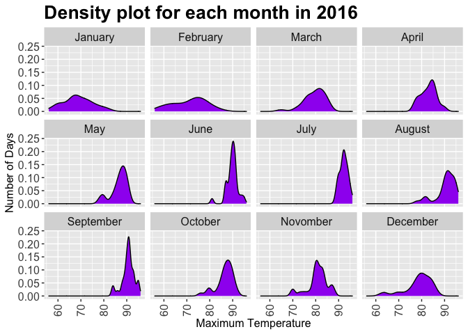
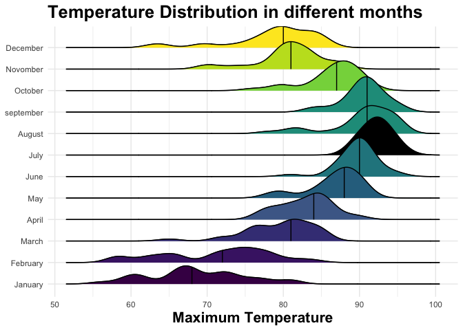

# Data Visualization Project 03


In this exercise some methods were explored to visualize text data and practice how to recreate charts that show the distributions of a continuous variable. 


## Part 1: Density Plots

Using the dataset obtained from FSU's, for a station at Tampa International Airport (TPA) from 2016 to 2017, attempt to recreate the charts some charts.


<!-- -->


```r
ggplot(data =Tampa_Weather,mapping = aes(x = max_temp)) +
geom_density(bw=0.5,fill="#808080", color="black")+ 
theme(axis.text.x = element_text(angle = 90, hjust = 1,vjust = 0.5, size = 10), 
 axis.text.y = element_text(size = 12),strip.text = element_text(size = 12),axis.title = element_text(size = 12))+ 
labs(x = "Maximum Temperature",y = "Number of Days",title = "Density of hottest days in Tampa ")+theme(plot.title = element_text(size = 20, face = "bold",color="tomato"))+theme_bw()
```

<!-- -->


```r
p<-ggplot(Tampa_Weather,aes(x=max_temp)) +
geom_density(binwidth = 3,fill="green") +
theme(axis.text.x = element_text(angle = 90, hjust = 1,vjust = 0.5, size = 12), 
 axis.text.y = element_text(size = 12),strip.text = element_text(size = 12),axis.title = element_text(size = 12)) +facet_wrap(~ month)+
labs(x = "Maximum Temperature",y = "Number of Days",title = "Density plot for each month in 2016 ")+theme(plot.title = element_text(size = 20, face = "bold",color="black"))+scale_fill_viridis_c()
```

```
## Warning: Ignoring unknown parameters: binwidth
```

```r
p+ scale_fill_viridis_d()
```

```
## Scale for 'fill' is already present. Adding another scale for 'fill', which
## will replace the existing scale.
```

<!-- -->


```r
library(ggridges)

p <- ggplot(data = Tampa_Weather,
            mapping = aes(x = max_temp, y = factor(month, levels = rev(unique(month)),
                                     ordered = TRUE)))
p + geom_density_ridges(alpha = 0.6, fill = "yellow", scale = 1.5) +
    stat_density_ridges(quantile_lines = TRUE, quantiles = 0.5,fill = "yellow", colour = "black")+
    scale_y_discrete(expand = c(0.01, 0)) + 
    labs(x = "Maximum Temperature", y = NULL,
         title = "Temperature Distribution in different months") +
    theme_ridges() +scale_fill_viridis_d()+
    theme(title = element_text(size = 16, face = "bold"))
```

```
## Picking joint bandwidth of 1.49
## Picking joint bandwidth of 1.49
```

<!-- -->


```r
library(viridis)
```

```
## Loading required package: viridisLite
```


```r
p <- ggplot(data = Tampa_Weather,
            mapping = aes(x = max_temp, y = factor(month, levels = rev(unique(month)),
                                     ordered = TRUE)))
p + geom_density_ridges(alpha = 0.6,scale = 1.5) +
    stat_density_ridges(quantile_lines = TRUE, quantiles = 0.5)+
    scale_y_discrete(expand = c(0.01, 0)) + 
    labs(x = "Maximum Temperature", y = NULL,
         title = "Temperature Distribution in different months")+ theme_bw()+scale_fill_viridis_d()+
    theme(title = element_text(size = 16, face = "bold"))+scale_fill_viridis( name = "Quantile", option = "plasma")
```

```
## Scale for 'fill' is already present. Adding another scale for 'fill', which
## will replace the existing scale.
```

```
## Picking joint bandwidth of 1.49
## Picking joint bandwidth of 1.49
```

<!-- -->
                   


```
## `summarise()` ungrouping output (override with `.groups` argument)
```

```r
ggplot(Tampa_Weather, aes(max_temp, fill=month))+
    geom_density(alpha=0.3)+
    facet_grid(month~.)+
    theme_bw(base_size=14)+scale_fill_viridis(
                     , name = "maximum temperature"
                     , option = "plasma")
```

<!-- -->


## Part 2: Visualizing Text Data


```r
library(tidyverse)
billboard<-read_csv("https://raw.githubusercontent.com/reisanar/datasets/master/BB_top100_2015.csv")
```

```
## Parsed with column specification:
## cols(
##   Rank = col_double(),
##   Song = col_character(),
##   Artist = col_character(),
##   Year = col_double(),
##   Lyrics = col_character(),
##   Source = col_double()
## )
```


```r
library(tidytext)
```


```r
head(billboard,8)
```

```
## # A tibble: 8 x 6
##    Rank Song       Artist            Year Lyrics                          Source
##   <dbl> <chr>      <chr>            <dbl> <chr>                            <dbl>
## 1     1 uptown fu… mark ronson fea…  2015 this hit that ice cold michell…      1
## 2     2 thinking … ed sheeran        2015 when your legs dont work like …      1
## 3     3 see you a… wiz khalifa fea…  2015 its been a long day without yo…      1
## 4     4 trap queen fetty wap         2015 im like hey wassup hello seen …      1
## 5     5 sugar      maroon 5          2015 im hurting baby im broken down…      1
## 6     6 shut up a… walk the moon     2015 oh dont you dare look back jus…      1
## 7     7 blank spa… taylor swift      2015 nice to meet you where you bee…      1
## 8     8 watch me   silento           2015 now watch me whip kill it now …      1
```


```r
#To see the columns in the data frame:

names(billboard) 
```

```
## [1] "Rank"   "Song"   "Artist" "Year"   "Lyrics" "Source"
```


```r
dim(billboard)
```

```
## [1] 100   6
```

```r
#To see how they are structured,choose lyrics column for one of the songs as a sample
str(billboard[100, ]$Lyrics, nchar.max = 50)
```

```
##  chr "i want you to breathe me in let m"| __truncated__
```

```r
# convert everything to lower case
billboard$Lyrics <- sapply(billboard$Lyrics, tolower)
```


```r
summary(billboard)
```

```
##       Rank            Song              Artist               Year     
##  Min.   :  1.00   Length:100         Length:100         Min.   :2015  
##  1st Qu.: 25.75   Class :character   Class :character   1st Qu.:2015  
##  Median : 50.50   Mode  :character   Mode  :character   Median :2015  
##  Mean   : 50.50                                         Mean   :2015  
##  3rd Qu.: 75.25                                         3rd Qu.:2015  
##  Max.   :100.00                                         Max.   :2015  
##                                                                       
##     Lyrics              Source     
##  Length:100         Min.   :1.000  
##  Class :character   1st Qu.:1.000  
##  Mode  :character   Median :1.000  
##                     Mean   :1.143  
##                     3rd Qu.:1.000  
##                     Max.   :5.000  
##                     NA's   :2
```


```r
billboard <- billboard %>%
  mutate(chart_level = ifelse(billboard$Rank %in% 1:10, "Top 10", 
           ifelse(billboard$Rank %in% 11:100, "Top 100", "Uncharted")))
```


```r
#Filtering top 10 songs:
billboard %>%
  filter(Rank <= 10 )
```

```
## # A tibble: 10 x 7
##     Rank Song     Artist         Year Lyrics                  Source chart_level
##    <dbl> <chr>    <chr>         <dbl> <chr>                    <dbl> <chr>      
##  1     1 uptown … mark ronson …  2015 this hit that ice cold…      1 Top 10     
##  2     2 thinkin… ed sheeran     2015 when your legs dont wo…      1 Top 10     
##  3     3 see you… wiz khalifa …  2015 its been a long day wi…      1 Top 10     
##  4     4 trap qu… fetty wap      2015 im like hey wassup hel…      1 Top 10     
##  5     5 sugar    maroon 5       2015 im hurting baby im bro…      1 Top 10     
##  6     6 shut up… walk the moon  2015 oh dont you dare look …      1 Top 10     
##  7     7 blank s… taylor swift   2015 nice to meet you where…      1 Top 10     
##  8     8 watch me silento        2015 now watch me whip kill…      1 Top 10     
##  9     9 earned … the weeknd     2015 you make it look like …      1 Top 10     
## 10    10 the hil… the weeknd     2015 your man on the road h…      1 Top 10
```


After creating plots I noticed there were some redundant characters in the text,so I tried to git rid of them by bellow function:

```r
Redundant_words <- c("meaning","youre","wanna","byjamesg","gotta","gonna","nigga","didnt","whats","niggas","bitch","dont","yeah","aint","wont")
```

Also using **stop_words** function to filter some specific words:

```r
head(sample(stop_words$word, 30), 30)
```

```
##  [1] "areas"         "themselves"    "each"          "available"    
##  [5] "several"       "any"           "know"          "others"       
##  [9] "few"           "provides"      "like"          "like"         
## [13] "thus"          "oldest"        "didn't"        "old"          
## [17] "nor"           "been"          "contains"      "he"           
## [21] "became"        "using"         "uucp"          "unfortunately"
## [25] "downed"        "on"            "course"        "the"          
## [29] "highest"       "just"
```


```r
##unnest and remove stop, undesirable and short words

billboard <- billboard %>%
  unnest_tokens(word, Lyrics) %>%
  anti_join(stop_words) %>%
  distinct() %>%
  filter(!word %in% Redundant_words) %>%
  filter(nchar(word) >= 4)
```

```
## Joining, by = "word"
```


#Look for top words frequency


#Top Words
In order to do a simple evaluation of the most frequently used words in the full set of lyrics, you can use count() and top_n() to get the n top words from your clean, filtered dataset. 


```r
billboard %>%
  count(word, sort = TRUE) %>%
  top_n(10) %>%
  ungroup() %>%
  mutate(word = reorder(word, n)) %>%
  ggplot() +
    geom_col(aes(word, n), fill ="pink") +
    theme(legend.position = "none", 
          plot.title = element_text(hjust = 0.5),
          panel.grid.major = element_blank()) +
    ylab("Song Count") +
    ggtitle("Most Frequently Used Words in billboard Lyrics") +
    coord_flip()
```

```
## Selecting by n
```

<!-- -->


#Popular Words


```r
popular_words <- billboard %>% 
  group_by(chart_level) %>%
  count(word, chart_level, sort = TRUE) %>%
  slice(seq_len(8)) %>%
  ungroup() %>%
  arrange(chart_level,n) %>%
  mutate(row = row_number()) 

popular_words %>%
  ggplot(aes(row, n, fill = chart_level)) +
    geom_col(show.legend = NULL) +
    labs(x = NULL, y = "Song Count") +
    ggtitle("Popular Words by Chart Level") + 
    facet_wrap(~chart_level, scales = "free") +
    scale_x_continuous(  # This handles replacement of row 
      breaks = popular_words$row, # notice need to reuse data frame
      labels = popular_words$word) +
    coord_flip()
```

```
## Warning: `show.legend` must be a logical vector.
```

<!-- -->


```r
popular_tfidf_words <- billboard %>%
  unnest_tokens(word, Song) %>%
  distinct() %>%
  filter(!word %in% Redundant_words) %>%
  filter(nchar(word) >= 4) %>%
  count(chart_level, word, sort = TRUE) %>%
  ungroup() %>%
  bind_tf_idf(word, chart_level, n)
head(popular_tfidf_words)
```

```
## # A tibble: 6 x 6
##   chart_level word      n     tf   idf tf_idf
##   <chr>       <chr> <int>  <dbl> <dbl>  <dbl>
## 1 Top 100     like      3 0.0236 0.693 0.0164
## 2 Top 100     love      3 0.0236 0.693 0.0164
## 3 Top 100     time      3 0.0236 0.693 0.0164
## 4 Top 100     down      2 0.0157 0.693 0.0109
## 5 Top 100     good      2 0.0157 0.693 0.0109
## 6 Top 100     heart     2 0.0157 0.693 0.0109
```
#TF-IDF
 Using TF-IDF certainly gives us a different perspective on potentially important words.


```r
top_popular_tfidf_words <- popular_tfidf_words %>%
  arrange(desc(tf_idf)) %>%
  mutate(word = factor(word, levels = rev(unique(word)))) %>%
  group_by(chart_level) %>% 
  slice(seq_len(8)) %>%
  ungroup() %>%
  arrange(chart_level, tf_idf) %>%
  mutate(row = row_number())

top_popular_tfidf_words %>%
  ggplot(aes(x = row, tf_idf, 
             fill = chart_level)) +
    geom_col(show.legend = NULL) +
    labs(x = NULL, y = "TF-IDF") + 
    ggtitle("Important Words using TF-IDF by Chart Level") +
    facet_wrap(~chart_level, ncol = 3, scales = "free") +
    scale_x_continuous(  # This handles replacement of row 
      breaks = top_popular_tfidf_words$row, # notice need to reuse data frame
      labels = top_popular_tfidf_words$word) +
    coord_flip()
```

```
## Warning: `show.legend` must be a logical vector.
```

<!-- -->

Conclusion
In this project, after checking the basics features and performing some actions such as data cleansing and removing uninformative words,an exploratory analysis was begun to categorize song levels.

Next,text visualizing was checked by unnesting lyrics into tokenized words so it was possible to look at lyric complexity. The results provide critical insights for the next steps of **sentiment analysis** and topic modeling.

Finally,**TF-IDF analysis**  was used to represent the information behind a word in a document relating to some outcome of interest. Result may look interesting, but it could be only some part od the whole story.
* use of **slice(seq_len(n))** to grab the first n words in each chart_level. 
* use **bind_tf_idf()** to run the formulas and create new columns.
